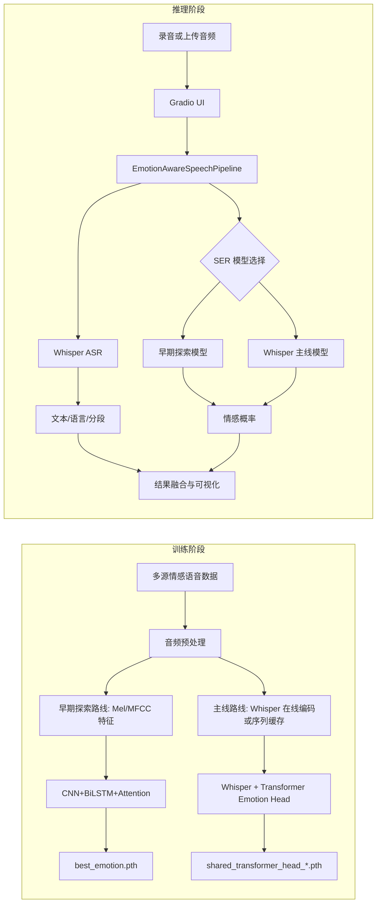
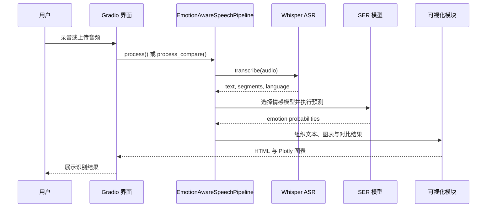

# 情感感知驱动的说话人语音识别系统

本项目面向说话人语音输入，联合完成自动语音识别（ASR）与语音情感识别（SER），并通过统一界面输出转写文本、情感类别、置信度与可视化结果。当前仓库以 Whisper 负责中英文转写，以 `CNN+BiLSTM+Attention` 作为项目早期的可解释探索路线，以 `Whisper + Transformer Emotion Head` 作为正式主线模型。需要说明的是，仓库当前不包含说话人身份验证或说话人分离模块，因此“说话人语音识别”在这里更准确地表示“面向说话人语音输入的识别与情感分析”。

## 核心能力

- 支持中文与英文语音转写。
- 支持 `happy`、`angry`、`sad`、`neutral`、`fear`、`surprise` 六类情感识别。
- 保留早期探索模型作为历史对照路径；界面默认仅展示主线模型，开启 `legacy.enabled=true` 后可恢复双模型对比。
- 支持围绕主线模型开展 `Derf` 与 `DyT` 的关键设计对比，同时保留 `LayerNorm` 与其他冻结策略作为兼容配置。
- 支持从数据整理、预处理、训练到界面推理的完整流程。
- 支持雷达图、波形图、Mel 频谱图与情感历史趋势可视化。

## 安装与使用

### 1. 环境准备

推荐在 Linux 或 AutoDL 环境中运行训练，训练阶段建议使用 NVIDIA GPU。当前文档对应的已验证环境为 `Python 3.12`、`PyTorch 2.3.0` 和 `CUDA 12.1`。

```bash
pip install -r requirements.txt
```

如果准备在服务器中通过 `tmux` 后台执行训练脚本或 notebook，请先确认 `tmux` 已安装；若仍需执行 notebook，再额外确认当前 Python 环境可导入 `nbformat` 与 `nbclient`：

```bash
tmux -V
python -c "import nbformat, nbclient; print('nbclient ok')"
```

如果当前环境没有 `sudo`，先执行 `whoami` 确认自己是否已经是 `root`。若输出为 `root`，可直接安装：

```bash
apt update
apt install -y tmux
```

### 2. 数据准备

项目通过 `configs/config.yaml` 读取数据与模型配置。`data/` 在很多环境中是软链接或外部挂载目录，开始训练前请确认它指向有效存储。当前仓库内置了 `RAVDESS`、`CASIA`、`TESS`、`ESD`、`EMODB` 和 `IEMOCAP` 的情感映射规则：

```text
data/raw/
├── ravdess/
├── casia/
├── tess/
├── esd/
├── emodb/
└── iemocap/
```

### 3. 音频预处理

先对原始音频执行统一的整理、降噪、静音切除、归一化、重采样和定长裁剪。处理结果会写入 `data/processed/<dataset>/`。

```bash
python preprocessing/audio_preprocess.py
```

### 4. 训练步骤

当前仓库仍然保留 notebook 层，但正式主线已经切换为 script-first。若目标是复现实验主线、生成可比的 `summary.json` / `aggregate.json`，或在后续 `4090` 环境中产出论文结果，应以 `scripts/train_shared.py` 作为执行真值；`notebooks/04_train_shared.ipynb` 现在承担结果分析与可视化职责，不再作为正式主线训练入口。

1. 如果训练早期探索模型 `CNN+BiLSTM+Attention`，先提取 Mel 与 MFCC 特征：

```bash
python preprocessing/feature_extract.py
```

随后执行 `notebooks/03_train_emotion.ipynb`，或在后台使用：

```bash
bash scripts/run_notebook_tmux.sh notebooks/03_train_emotion.ipynb baseline_train
```

该路线默认输出 `checkpoints/best_emotion.pth` 和 `checkpoints/emotion_history.npz`，主要用于历史对照和可解释性验证。

2. 如果训练正式主线模型 `Whisper + Transformer Emotion Head`，推荐直接使用脚本入口：

```bash
bash scripts/train_shared_tmux.sh --session-name shared_audit -- --profile cpu_preflight --audit-only
```

该命令适用于无 GPU 或仅需预检的环境。它不会启动正式训练，而是完成数据筛选、标签策略审计、主/辅数据子集划分、`speaker-group split` 检查以及运行时配置确认。当前 `cpu_preflight` profile 会自动切换到更轻量的 `tiny` Whisper、收紧 batch size，并把运行限制在预检边界内。

当 `4090` 环境可用后，正式主线训练应使用：

```bash
bash scripts/train_shared_tmux.sh --session-name shared_derf_4090 --log-prefix shared_derf_4090 -- --profile cuda_4090_mainline --norm derf --seed 42
bash scripts/train_shared_tmux.sh --session-name shared_dyt_4090 --log-prefix shared_dyt_4090 -- --profile cuda_4090_mainline --norm dyt --seed 42
```

这两条命令共享同一套主线协议，只切换 `norm` 变量，用于执行论文主叙事中的 `Derf / DyT` 关键对比。其中 `--session-name` 指定 tmux 会话名，`--` 后的参数会原样传给 `scripts/train_shared.py`，`--profile cuda_4090_mainline` 表示启用面向正式 GPU 训练的运行配置，而 `--norm derf` 与 `--norm dyt` 则用于固定同一协议下的唯一对比变量。

当前脚本化主线默认执行以下约束，这些约束会在运行时被显式写入 checkpoint 与 summary 元数据：

- `shared_model.variant=transformer_head`
- `shared_model.training_mode=live_encoder`
- `shared_model.pooling=attention`
- `shared_model.freeze_strategy=unfreeze_last_2`
- `shared_model.norm in {derf, dyt}`，默认候选为 `derf`
- 数据策略采用 `staged_clean`：保留 `calm->neutral`、`ps/pleasant_surprise->surprise`、`exc->happy`、`fru->angry` 等近邻映射，同时丢弃 `disgust`、`boredom` 与 `IEMOCAP dis` 等当前标签体系不支持的原始情感
- 主基准仅包含 `RAVDESS`、`CASIA`、`ESD`、`EMODB` 和 `IEMOCAP`，`TESS` 因说话人数量不足而作为辅助评估集单独处理
- 最佳 checkpoint 统一按 `val_subset_mean_uar -> val_uar -> val_loss` 的链式规则选择

主线训练完成后，典型输出包括：

- `checkpoints/shared_transformer_head_*_seed<seed>.pth`
- `checkpoints/shared_transformer_head_*_seed<seed>_history.npz`
- `checkpoints/shared_transformer_head_*_seed<seed>_summary.json`
- `checkpoints/shared_transformer_head_*_seed<seed>_curves.png`
- `checkpoints/shared_transformer_head_*_seed<seed>_confusion_matrix.png`
- `checkpoints/shared_transformer_head_*_aggregate.json`

其中 `summary.json` / `aggregate.json` 会额外记录 `data_policy_audit`、`runtime_profile`、`runtime_eval_sampling`、`selected_val_subset_mean_uar`、`test_subset_mean_uar`、`criterion_name`、`criterion_config` 和 `class_weights`，用于严格协议下的结果复核。

3. 如果你需要在训练完成后做结果复盘、图表查看与多实验对比，可直接打开分析 notebook：

```bash
jupyter lab notebooks/04_train_shared.ipynb
```

该 notebook 只读取已有 `checkpoints/` 产物进行分析与可视化，不再承担“准备数据集 -> 构建模型 -> 训练 -> 测试集评估”的主流程。换言之，正式训练的可比结果应优先来自 `scripts/train_shared.py` 产出的 checkpoint 和 summary，而 notebook 只负责复盘这些已有结果。

4. 如果需要切换共享模型的实验配置，优先修改 `configs/config.yaml` 中的 `shared_model`、`training`、`runtime` 与 `data_policy` 字段。对于论文主流程，建议把变量控制在 `norm=derf/dyt` 这一维上，不再把 `freeze_strategy`、`layernorm` 等兼容项混入默认叙事；这些兼容配置仍受代码支持，但当前仓库不再把它们视为正式主线流程的一部分。

### 5. 推理与界面

完成训练后，可以直接启动 Gradio 界面进行主线推理验证。界面默认仅展示正式主线模型 `Whisper + Transformer Emotion Head`；若需要恢复早期探索模型的对照入口，可在 `configs/config.yaml` 中把 `legacy.enabled` 改为 `true`。

```bash
python ui/app.py
```

如果要在脚本中复用推理流程，可直接使用 `inference/pipeline.py` 中的 `EmotionAwareSpeechPipeline`。

## 架构图与时序图

### 系统架构图



### 推理时序图



## 项目结构与文件组织

```text
Emotion-perception-driven-speech-recognition-system/
├── README.md
├── theory.md
├── requirements.txt
├── configs/
│   └── config.yaml
├── scripts/
│   ├── evaluate_shared_ui_path.py
│   ├── execute_notebook_live.py
│   ├── run_notebook_tmux.sh
│   ├── train_shared.py
│   └── train_shared_tmux.sh
├── models/
│   ├── emotion_cnn_bilstm.py
│   └── whisper_emotion.py
├── preprocessing/
│   ├── audio_preprocess.py
│   ├── feature_extract.py
│   └── whisper_feature_cache.py
├── inference/
│   └── pipeline.py
├── ui/
│   └── app.py
├── utils/
│   ├── audio_utils.py
│   ├── data_policy.py
│   ├── losses.py
│   ├── split_utils.py
│   └── visualization.py
├── notebooks/
│   ├── 01_data_exploration.ipynb
│   ├── 02_feature_analysis.ipynb
│   ├── 03_train_emotion.ipynb
│   └── 04_train_shared.ipynb
├── checkpoints/
│   └── *.pth / *.npz / *.json / *.png
├── logs/
│   └── *.log (运行时生成)
├── runs/
│   └── *.executed.<timestamp>.ipynb (仅 notebook 后台执行时生成)
└── data/
    ├── raw/
    ├── processed/
    ├── features/
    └── features_shared/
```

- `configs/` 统一管理音频参数、训练配置、模型超参数、运行 profile 和权重路径。
- `scripts/train_shared.py` 是正式主线训练入口，负责数据策略过滤、主辅数据子集划分、训练、评估与实验摘要输出。
- `scripts/train_shared_tmux.sh` 用于在 `tmux` 中后台执行正式主线训练脚本。
- `scripts/run_notebook_tmux.sh` 与 `scripts/execute_notebook_live.py` 保留为历史 notebook 后台执行工具，主要服务于早期探索路线或旧实验复盘。
- `scripts/evaluate_shared_ui_path.py` 用于按当前 UI 主线路径复核共享模型结果。
- `models/` 保存早期探索路线与主线路线的核心实现，其中 `whisper_emotion.py` 集中维护 `DyT`、`Derf` 与 checkpoint 兼容逻辑。
- `preprocessing/` 负责原始音频整理、常规特征提取和 Whisper 训练数据准备。
- `utils/data_policy.py` 负责 `staged_clean` 标签策略、样本过滤与数据审计。
- `notebooks/` 保留历史 notebook 与分析 notebook，其中 `03_train_emotion.ipynb` 仍用于早期探索路线，`04_train_shared.ipynb` 用于主线实验的结果分析与可视化。
- `checkpoints/` 保存权重、训练历史、混淆矩阵、曲线图与实验摘要。
- `logs/` 为脚本或 notebook 后台执行时自动生成的日志目录，`runs/` 仅在 notebook 后台执行时生成执行后的 notebook 文件。

## 运行注意事项

- 若 `best_emotion.pth` 或 `paths.best_shared_model` 缺失，界面仍可启动，但情感结果可能来自随机权重，不可直接用于实验结论。
- 当前默认主线 checkpoint 为 `checkpoints/shared_transformer_head_live_encoder_attention_derf_unfreeze_last_2_seed42.pth`，与 `configs/config.yaml` 中的 `paths.best_shared_model` 保持一致。
- `cpu_preflight` 仅用于无 GPU 环境下的数据审计与流程预检；正式论文结果应在 `cuda_4090_mainline` profile 下生成。
- `live_encoder` 是正式主线协议；`cached_sequence` 仍可用于快速结构验证，但不再是论文主叙事的默认训练入口。
- `data/` 通常不是完整随仓库分发的目录，训练前请先确认软链接或挂载路径有效。
