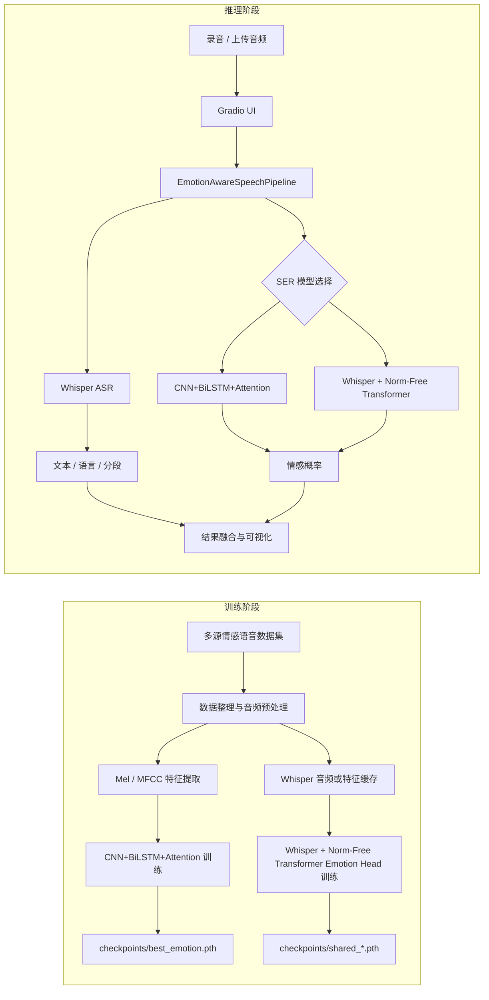
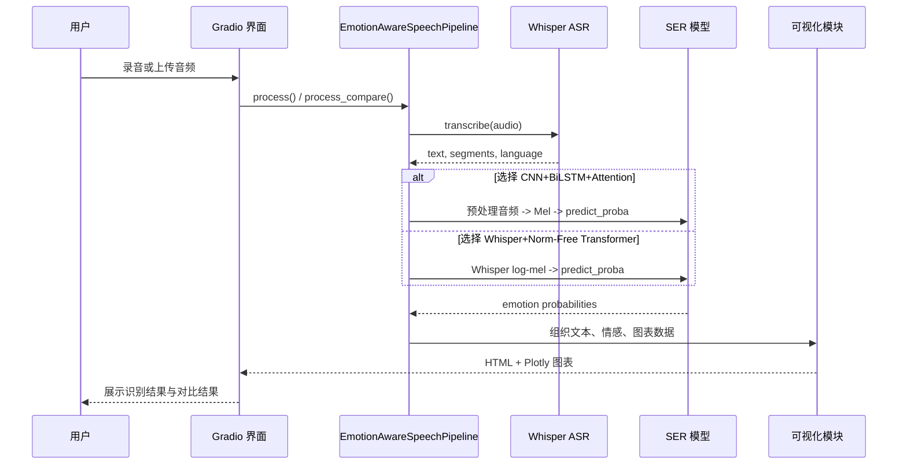

# 情感感知驱动的说话人语音识别系统

本项目面向说话人语音输入，联合完成自动语音识别（ASR）与语音情感识别（SER）两项任务，并通过统一的可视化界面输出转写文本、情感类别、置信度和情感分布图。当前实现以 OpenAI Whisper 负责中英文语音转写，以 `CNN+BiLSTM+Attention` 传统基线和 `Whisper + Normalization-Free Transformer Emotion Head` 毕设主线完成六分类情感识别，其中主线默认无归一化方案为 `Derf`。需要说明的是，仓库当前并未实现说话人身份验证或说话人分离模块，因此这里的“说话人语音识别”更准确地指向“面向说话人语音输入的识别与情感分析系统”。

## 核心能力

- 支持中英文语音转文字，底层 ASR 模块为 Whisper。
- 支持高兴、愤怒、悲伤、中性、恐惧、惊讶六类语音情感识别。
- 支持两条 SER 路线切换与同音频双模型对比分析。
- 支持录音与文件上传两种输入方式。
- 支持雷达图、波形图、Mel 频谱图与情感历史趋势可视化。
- 支持从多数据集整理、预处理、特征提取、训练到界面推理的完整流程。

## 模型路线概览

| 路线                                                    | 对应实现                       | 角色定位         | 当前说明                                                                                        |
| ------------------------------------------------------- | ------------------------------ | ---------------- | ----------------------------------------------------------------------------------------------- |
| `CNN+BiLSTM+Attention`                                  | `models/emotion_cnn_bilstm.py` | 传统深度学习基线 | 使用 `128` 维 Mel 频谱图，突出局部时频模式与时序聚合                                            |
| `Whisper + Normalization-Free Transformer Emotion Head` | `models/whisper_emotion.py`    | 毕设主线模型     | 默认 `variant=transformer_head`、`training_mode=live_encoder`、`pooling=attention`、`norm=derf` |
| `legacy_mlp`                                            | `models/whisper_emotion.py`    | 向后兼容路径     | 仅用于兼容旧版“共享编码器 + MLP 分类头”检查点，不应替代主线描述                                 |

## 安装与使用说明

### 1. 环境准备

推荐在具备 NVIDIA GPU 的 Linux 或 AutoDL 环境中运行训练流程，当前项目文档对应的已验证环境为：

```bash
Python 3.12
PyTorch 2.3.0
CUDA 12.1
```

如果仅做界面推理，CPU 也可以运行，但 Whisper 和主线情感模型的推理速度会明显下降。

安装依赖：

```bash
pip install -r requirements.txt
```

### 2. 数据准备

项目默认从 `configs/config.yaml` 读取数据与模型配置，原始数据目录约定为 `data/raw/`，预处理结果目录约定为 `data/processed/`，常规特征目录约定为 `data/features/`。仓库中的 `data/` 往往通过软链接或外部挂载方式接入，因此在开始训练前，应先将数据集整理到以下结构中，或建立同名软链接。

- `data/raw/ravdess/`
- `data/raw/casia/`
- `data/raw/tess/`
- `data/raw/esd/`
- `data/raw/emodb/`
- `data/raw/iemocap/`

当前代码内置了以下公开数据集的整理逻辑与情感映射规则：

- RAVDESS
- CASIA
- TESS
- ESD
- EMODB
- IEMOCAP

### 3. 音频预处理

运行下面的命令后，脚本会自动识别已经存在于 `data/raw/` 下的数据集目录，并依次完成数据集整理、降噪、静音切除、归一化、重采样与定长裁剪，最终把结果写入 `data/processed/<dataset>/`。

```bash
python preprocessing/audio_preprocess.py
```

该步骤会为 RAVDESS、CASIA、TESS、ESD、EMODB 和 IEMOCAP 分别生成标准化后的六类情感目录，并保留统一的 `16 kHz` 采样率与配置中指定的最小时长、最大时长约束。

### 4. 常规特征提取

传统基线模型依赖 Mel 与 MFCC 特征，因此需要继续执行特征提取脚本。该脚本会遍历 `data/processed/` 中的已处理数据，并把特征保存为 `.npy` 文件。

```bash
python preprocessing/feature_extract.py
```

输出目录结构如下：

- `data/features/<dataset>/mel/<emotion>/*.npy`
- `data/features/<dataset>/mfcc/<emotion>/*.npy`

### 5. 训练传统基线模型

传统基线模型的训练流程位于 `notebooks/03_train_emotion.ipynb`。先启动 Jupyter，再按笔记本中的顺序执行数据加载、划分、训练、验证与测试单元。

训练完成后，模型权重通常保存为：

- `checkpoints/best_emotion.pth`

当前 `notebooks/03_train_emotion.ipynb` 也固定采用 `speaker_group split`，并会覆盖 `emotion_history.npz` 与基线模型权重。因此如果你重新整理了数据，或想让主线与基线保持同一划分标准，应重新运行该 notebook，再执行跨架构对比。

### 6. 训练 Whisper 主线模型

主线模型训练位于 `notebooks/04_train_shared.ipynb`。该笔记本默认读取 `configs/config.yaml` 中的 `shared_model` 配置，并使用 `Whisper + Normalization-Free Transformer Emotion Head` 路线。默认情况下，`training_mode=live_encoder`，表示直接输入音频并在线运行 Whisper 编码器，同时在 Emotion Head 中采用 `Derf` 作为主线默认无归一化设计。如果 GPU 显存或 I/O 受限，可以切换为 `cached_sequence` 以缓存序列特征；当前版本会按照 `audio.max_duration` 对应的有效帧长度截断缓存，而不是按 Whisper `30s` 全长保存，从而避免生成过大的 `sequence_features.npy`。如果只是兼容旧版共享编码器基线，则可以使用 `cached_pooled`，但该模式不属于当前论文主线。

当前代码结构里：

- `Derf` 是毕设主线默认配置，对应主结果与主叙事。
- `DyT` 是无归一化 Transformer 的对比配置，可作为消融实验设置。
- `LayerNorm` 是标准归一化兼容配置，也可作为消融实验设置。

`LayerNorm` 和 `DyT` 被保留为“兼容 + 对比 + 消融”三位一体的配置入口。

#### 6.1 切换主线与消融配置

做主线实验或归一化对比实验时，直接修改 `configs/config.yaml` 中的 `shared_model.norm` 即可：

```yaml
shared_model:
  variant: "transformer_head"
  training_mode: "live_encoder"
  pooling: "attention"
  norm: "derf" # 主线默认
  freeze_strategy: "freeze_all"
```

可选值如下：

- `norm: "derf"`：主线默认配置，推荐作为论文主结果。
- `norm: "dyt"`：无归一化对比配置，可作为归一化消融实验之一。
- `norm: "layernorm"`：标准归一化对比配置，可作为归一化消融实验之一。

如果你使用类似 `16` 核 CPU 与 `24GB` 显存 `RTX 4090` 的训练环境，建议同时在 `training` 段落中启用较积极的 `live_encoder` 吞吐配置：

```yaml
training:
  live_encoder_batch_size: 16
  live_encoder_eval_batch_size: 16
  live_encoder_num_workers: 8
  live_encoder_eval_num_workers: 8
  live_encoder_prefetch_factor: 4
  live_encoder_eval_prefetch_factor: 4
  live_encoder_persistent_workers: true
  live_encoder_eval_persistent_workers: true
```

这些参数分别控制 `live_encoder` 训练批大小、验证批大小、DataLoader 并行读取进程数、预取深度以及 worker 常驻策略。如果出现显存不足，可以优先把 `live_encoder_batch_size` 从 `16` 降到 `12` 或 `8`；如果 CPU 或磁盘压力过高，则把 `live_encoder_num_workers` 和 `live_encoder_eval_num_workers` 下调到 `4`。

#### 6.2 归一化与冻结策略消融的推荐操作流程

归一化消融，比较 `Derf`、`DyT`、`LayerNorm` ：

1. 在 `configs/config.yaml` 中：
    `shared_model.training_mode` 设为 `cached_sequence`
    `shared_model.norm` 设为 `derf`
    `shared_model.freeze_strategy` 设为 `freeze_all`
    运行 `notebooks/04_train_shared.ipynb`，得到 Derf 结果。
3. 将 `shared_model.norm` 改为 `dyt`，重新运行同一 notebook，得到 DyT 归一化对比结果。
4. 将 `shared_model.norm` 改为 `layernorm`，再次运行同一 notebook，得到标准归一化对比结果。

冻结策略消融，比较 `freeze_all`、`unfreeze_last_2`
1. 在 `configs/config.yaml` 中：
    `shared_model.training_mode` 设为 `live_encoder`
    `shared_model.norm` 设为 `derf`
    `shared_model.freeze_strategy` 设为 `freeze_all`
    运行 `notebooks/04_train_shared.ipynb`，得到 freeze_all 结果。
2. 将 `shared_model.freeze_strategy` 改为 `unfreeze_last_2`，再次运行同一 notebook，得到冻结策略消融结果。

每轮训练完成后，直接执行 notebook 末尾的对比单元；只要对应实验文件已生成，章节 7 会自动汇总归一化消融，章节 8 会自动汇总冻结策略消融。

当前默认训练划分为 `speaker_group split`。因此同一说话人的样本不会同时落入训练集、验证集与测试集。实验文件名仍沿用原有命名规则，不额外附加划分后缀；重新训练后，新结果会直接覆盖旧的同名实验文件。

从当前版本开始，`notebooks/04_train_shared.ipynb` 会自动为每次实验生成独立命名的结果文件，不需要再手动另存。以主线默认配置为例，典型输出如下：

- `checkpoints/shared_transformer_head_live_encoder_attention_derf_freeze_all.pth`
- `checkpoints/shared_transformer_head_live_encoder_attention_derf_freeze_all_history.npz`
- `checkpoints/shared_transformer_head_live_encoder_attention_derf_freeze_all_summary.json`
- `checkpoints/shared_transformer_head_live_encoder_attention_derf_freeze_all_curves.png`
- `checkpoints/shared_transformer_head_live_encoder_attention_derf_freeze_all_confusion_matrix.png`

#### 6.3 Notebook 内置对比入口

`notebooks/04_train_shared.ipynb` 末尾已经内置三类对比入口：

1. 第 6 节“跨架构对比”比较 `CNN+BiLSTM+Attention` 与当前 `shared_model` 配置对应的 `Whisper+Transformer Emotion Head` 实验；在默认配置下，这一项就是 `Derf` 主线。
2. 第 7 节“归一化消融对比”比较 `Derf / DyT / LayerNorm`，默认读取 `freeze_all` 条件下的实验结果。
3. 第 8 节“冻结策略消融对比”比较 `Derf + freeze_all` 与 `Derf + unfreeze_last_2`。

只要实验命名保持与 notebook 自动生成的规则一致，上述对比单元就会自动加载对应的 `history` 与 `summary` 文件，并输出验证曲线、测试指标汇总表，以及：

- `checkpoints/model_comparison.png`
- `checkpoints/shared_norm_ablation.png`
- `checkpoints/shared_freeze_ablation.png`

#### 6.4 如何让某个配置参与推理或界面展示

推荐优先使用“直接指向实验文件”的方式切换共享模型：

1. 先运行 `notebooks/04_train_shared.ipynb`，获得你需要的实验专属文件，例如 `checkpoints/shared_transformer_head_live_encoder_attention_dyt_freeze_all.pth`。
2. 修改 `configs/config.yaml` 中的 `paths.best_shared_model`，直接指向该实验文件。
3. 重新启动 `ui/app.py` 或重新创建推理 pipeline，使新路径生效。

例如，要让 DyT 消融模型参与推理，可以写成：

```yaml
paths:
  best_shared_model: "checkpoints/shared_transformer_head_live_encoder_attention_dyt_freeze_all.pth"
```

Whisper 特征缓存与元数据默认写入：

- `data/features_shared/whisper_<size>_sequence_features.npy`
- `data/features_shared/whisper_<size>_sequence_labels.npy`
- `data/features_shared/whisper_<size>_sequence_lengths.npy`
- `data/features_shared/whisper_<size>_sequence_meta.json`

### 7. 启动图形界面

当至少存在可用的情感模型权重后，即可启动 Gradio 界面。若仓库中已自带训练好的权重，也可以直接跳过训练步骤，先体验推理流程。

```bash
python ui/app.py
```

界面默认提供以下能力：

- 录音或上传音频文件。
- 在 `CNN+BiLSTM+Attention` 与 `Whisper+Norm-Free Transformer` 两条路线间切换。
- 对同一段音频执行双模型对比分析。
- 查看转写文本、情感高亮、雷达图、波形图、Mel 频谱图与历史趋势图。

### 8. 直接推理入口

如果希望在脚本中复用推理能力，可直接调用 `inference/pipeline.py` 中的 `EmotionAwareSpeechPipeline`。该类会统一加载 Whisper ASR、基线情感模型与主线情感模型，并输出标准化结果字典，包括文本、语言、分段信息、情感类别、情感概率、颜色编码、置信度与实际使用的模型名称。

## 架构图与时序图

### 系统架构图



### 推理时序图



## 运行注意事项

- `best_emotion.pth` 或 `paths.best_shared_model` 指向的共享模型权重缺失时，界面仍然可以打开，但情感输出可能来自随机权重，不能直接用于论文结论。
- `Whisper + Normalization-Free Transformer Emotion Head` 的默认训练模式是 `live_encoder`，该模式最贴近实际主线实验，但显存与算力需求最高。
- 主线默认 `norm=derf`，这对应无归一化 Transformer 路线；`LayerNorm` 与 `DyT` 仍保留为兼容和对比配置。
- `cached_sequence` 可以降低重复编码开销，但因为序列特征已离线固定，训练阶段无法真正更新 Whisper 编码器；首次运行会根据 `audio.max_duration` 生成截断后的序列缓存，若检测到旧版全长缓存则会自动重建。
- `cached_pooled` 主要服务于旧版 `legacy_mlp` 路线，不能替代当前主线中的 Transformer Emotion Head。
- `data/` 目录在很多部署环境中不会随仓库一并提供，开始训练前应先检查软链接或挂载路径是否正确。

## 项目结构与文件组织

```text
Emotion-perception-driven-speech-recognition-system/
├── README.md
├── theory.md
├── requirements.txt
├── configs/
│   └── config.yaml
├── models/
│   ├── emotion_cnn_bilstm.py
│   └── whisper_emotion.py
├── preprocessing/
│   ├── audio_preprocess.py
│   ├── feature_extract.py
│   └── whisper_feature_cache.py
├── inference/
│   └── pipeline.py
├── ui/
│   └── app.py
├── utils/
│   ├── audio_utils.py
│   ├── losses.py
│   └── visualization.py
├── notebooks/
│   ├── 01_data_exploration.ipynb
│   ├── 02_feature_analysis.ipynb
│   ├── 03_train_emotion.ipynb
│   └── 04_train_shared.ipynb
├── checkpoints/
│   ├── best_emotion.pth
│   ├── best_shared.pth
│   ├── shared_transformer_head_*.pth
│   └── *.png / *.npz / *.json
└── data/
    ├── raw/
    ├── processed/
    ├── features/
    └── features_shared/
```

- `configs/` 统一管理音频参数、情感标签、模型超参数、训练设置和路径配置，是所有脚本与笔记本的事实来源。
- `models/` 存放两条 SER 路线的核心实现，其中 `emotion_cnn_bilstm.py` 是传统基线，`whisper_emotion.py` 是当前毕设主线。
- `preprocessing/` 负责数据整理、音频预处理、常规特征提取与 Whisper 特征缓存。
- `inference/` 提供统一推理流水线，负责把 Whisper ASR 与 SER 模块编排为完整的结果输出。
- `ui/` 提供 Gradio 前端，便于演示录音、上传、单模型分析与双模型对比。
- `utils/` 存放配置加载、音频读写、标签映射、损失函数和图表生成等通用工具。
- `notebooks/` 承担探索性分析和训练实验，是论文复现与结果导出的主要入口。
- `checkpoints/` 保存训练完成后的权重、曲线图、混淆矩阵和模型比较图。
- `data/` 用于存放外部接入的数据集、预处理结果与特征缓存，通常不会完整随仓库版本管理。
