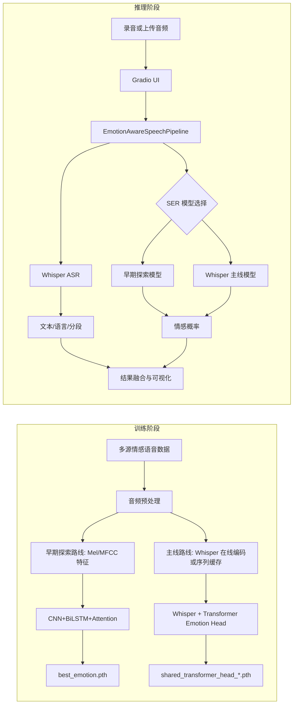
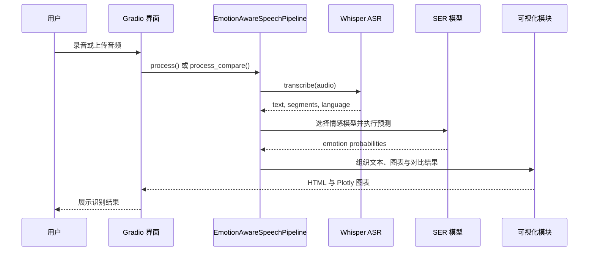

# 情感感知驱动的说话人语音识别系统

本项目面向说话人语音输入，联合完成自动语音识别（ASR）与语音情感识别（SER），并通过统一界面输出转写文本、情感类别、置信度与可视化结果。当前仓库以 Whisper 负责中英文转写，以 `CNN+BiLSTM+Attention` 作为项目早期的可解释探索路线，以 `Whisper + Transformer Emotion Head` 作为正式主线模型。需要说明的是，仓库当前不包含说话人身份验证或说话人分离模块，因此“说话人语音识别”在这里更准确地表示“面向说话人语音输入的识别与情感分析”。

## 核心能力

- 支持中文与英文语音转写。
- 支持 `happy`、`angry`、`sad`、`neutral`、`fear`、`surprise` 六类情感识别。
- 支持早期探索模型与主线模型切换，并支持同一音频的双模型对比。
- 支持围绕主线模型开展 `Derf` 与 `DyT` 的关键设计对比，同时保留 `LayerNorm` 与其他冻结策略作为兼容配置。
- 支持从数据整理、预处理、训练到界面推理的完整流程。
- 支持雷达图、波形图、Mel 频谱图与情感历史趋势可视化。

## 安装与使用

### 1. 环境准备

推荐在 Linux 或 AutoDL 环境中运行训练，训练阶段建议使用 NVIDIA GPU。当前文档对应的已验证环境为 `Python 3.12`、`PyTorch 2.3.0` 和 `CUDA 12.1`。

```bash
pip install -r requirements.txt
```

### 2. 数据准备

项目通过 `configs/config.yaml` 读取数据与模型配置。`data/` 在很多环境中是软链接或外部挂载目录，开始训练前请确认它指向有效存储。当前仓库内置了 `RAVDESS`、`CASIA`、`TESS`、`ESD`、`EMODB` 和 `IEMOCAP` 的情感映射规则：

```text
data/raw/
├── ravdess/
├── casia/
├── tess/
├── esd/
├── emodb/
└── iemocap/
```

### 3. 音频预处理

先对原始音频执行统一的整理、降噪、静音切除、归一化、重采样和定长裁剪。处理结果会写入 `data/processed/<dataset>/`。

```bash
python preprocessing/audio_preprocess.py
```

### 4. 训练步骤

当前仓库有两条训练路线，建议先明确自己要复现的是“早期探索路线”还是“正式主线”。

1. 如果训练早期探索模型 `CNN+BiLSTM+Attention`，先提取 Mel 与 MFCC 特征，再运行 `notebooks/03_train_emotion.ipynb`。

```bash
python preprocessing/feature_extract.py
```

然后按顺序执行 `notebooks/03_train_emotion.ipynb` 中的“准备数据 -> 构建模型 -> 训练 -> 测试集评估”单元。默认输出包括 `checkpoints/best_emotion.pth` 和 `checkpoints/emotion_history.npz`。

2. 如果训练正式主线模型 `Whisper + Transformer Emotion Head`，直接运行 `notebooks/04_train_shared.ipynb`，不需要先执行 `feature_extract.py`。该 notebook 会基于 `data/processed/` 自动准备训练数据；当 `training_mode=cached_sequence` 时，还会自动生成 Whisper 序列缓存。

然后按顺序执行 `notebooks/04_train_shared.ipynb` 中的“准备数据集 -> 构建模型 -> 训练 -> 测试集评估”单元。当前默认主线配置如下：

- `shared_model.training_mode=live_encoder`
- `shared_model.pooling=attention`
- `shared_model.norm=derf`
- `shared_model.freeze_strategy=unfreeze_last_2`
- `training.best_metric=subset_mean_uar`

当前版本的主线训练还包含以下默认约定：

- 严格主基准仅包含 `RAVDESS`、`CASIA`、`ESD`、`EMODB` 和 `IEMOCAP`，并按数据子集分别执行 `speaker-group split`，避免同一说话人同时出现在训练集、验证集和测试集中。
- `TESS` 因有效说话人数量不足以稳定支持三路 `speaker-group split`，当前默认作为辅助评估集，不再并入主 checkpoint 选择或主表指标。
- 每个 epoch 会按 `training.subset_epoch_targets` 对主基准各数据子集做目标采样；当小语料样本不足时，训练集会先全量取一遍，再按类别感知概率有放回补足，进一步减弱 `ESD` 的主导效应。
- 最佳 checkpoint 统一按 `val_subset_mean_uar` 选择，并以 `val_uar`、`val_loss` 作为并列判定条件。
- `live_encoder` 路线默认启用带类别权重的 `FocalLoss`、Mel 级训练增强与子集均衡采样，`cached_sequence` 路线继续使用特征级遮蔽、dropout 与噪声增强。

主线训练完成后，典型输出包括：

- `checkpoints/shared_transformer_head_*_seed<seed>.pth`
- `checkpoints/shared_transformer_head_*_seed<seed>_history.npz`
- `checkpoints/shared_transformer_head_*_seed<seed>_summary.json`
- `checkpoints/shared_transformer_head_*_seed<seed>_curves.png`
- `checkpoints/shared_transformer_head_*_seed<seed>_confusion_matrix.png`
- `checkpoints/shared_transformer_head_*_aggregate.json`

其中新的 `summary.json` / `aggregate.json` 会额外记录 `selected_val_subset_mean_uar`、`test_subset_mean_uar`、`criterion_name`、`criterion_config` 和 `class_weights`，用于严格协议下的可比分析。

3. 如果需要切换共享模型的实验配置，优先修改 `configs/config.yaml` 中的以下字段：

```yaml
shared_model:
  training_mode: "live_encoder"   # 或 cached_sequence
  pooling: "attention"            # 或 mean
  norm: "derf"                    # 关键对比为 derf / dyt
  freeze_strategy: "unfreeze_last_2"   # 主线默认；兼容 freeze_all / unfreeze_last_4

paths:
  best_shared_model: "checkpoints/shared_transformer_head_live_encoder_attention_derf_unfreeze_last_2.pth"

training:
  best_metric: "subset_mean_uar"
  protocol_version: 2
  main_subsets: ["ravdess", "casia", "esd", "emodb", "iemocap"]
  auxiliary_subsets: ["tess"]
  seed_sweep: [42, 52, 62]
  subset_sampling_mode: "balanced_class_aware"
  subset_epoch_targets:
    ravdess: 1200
    casia: 900
    emodb: 700
    iemocap: 2200
    esd: 2000
  live_encoder_focal_loss: true
  live_encoder_focal_gamma: 1.5
```

### 4.1 关键对比实验

`notebooks/04_train_shared.ipynb` 当前默认只保留两类与论文主叙事直接对应的结果输出，即跨架构对比和 `Derf / DyT` 关键对比。`LayerNorm` 与更多冻结策略仍保留在代码和 checkpoint 兼容路径中，但不再作为 README 推荐的默认实验流程。

1. 跨架构对比要求早期探索 notebook 和主线 notebook 都已完成训练。确保 `checkpoints/emotion_history.npz` 与当前共享模型的 `*_history.npz` 存在后，执行 notebook 第 6 节即可生成 `checkpoints/model_comparison.png`。

2. `Derf` 与 `DyT` 对比统一采用与部署主线一致的协议，即固定 `training_mode=live_encoder`、`pooling=attention`、`freeze_strategy=unfreeze_last_2`，仅替换 `norm`：

```yaml
shared_model:
  variant: "transformer_head"
  training_mode: "live_encoder"
  pooling: "attention"
  norm: "derf" # 再切换为 dyt
  freeze_strategy: "unfreeze_last_2"
```

完成两次训练后，执行 notebook 第 7 节会读取对应的 `*_history.npz` 与 `*_summary.json`，并输出 `checkpoints/shared_derf_dyt_comparison.png`。

3. 如果需要复查兼容性配置，可以手动将 `norm` 改为 `layernorm`，或将 `freeze_strategy` 改为 `freeze_all`、`unfreeze_last_4`。这些配置仍然受代码支持，但当前仓库不再把它们作为默认论文流程的一部分。

### 5. 推理与界面

完成训练后，可以直接启动 Gradio 界面进行单模型或双模型推理验证。界面默认选择正式主线模型 `Whisper + Transformer Emotion Head`，同时保留早期探索模型用于对照观察。

```bash
python ui/app.py
```

如果要在脚本中复用推理流程，可直接使用 `inference/pipeline.py` 中的 `EmotionAwareSpeechPipeline`。

## 架构图与时序图

### 系统架构图



### 推理时序图



## 项目结构与文件组织

```text
Emotion-perception-driven-speech-recognition-system/
├── README.md
├── theory.md
├── requirements.txt
├── configs/
│   └── config.yaml
├── models/
│   ├── emotion_cnn_bilstm.py
│   └── whisper_emotion.py
├── preprocessing/
│   ├── audio_preprocess.py
│   ├── feature_extract.py
│   └── whisper_feature_cache.py
├── inference/
│   └── pipeline.py
├── ui/
│   └── app.py
├── utils/
│   ├── audio_utils.py
│   ├── losses.py
│   ├── split_utils.py
│   └── visualization.py
├── notebooks/
│   ├── 01_data_exploration.ipynb
│   ├── 02_feature_analysis.ipynb
│   ├── 03_train_emotion.ipynb
│   └── 04_train_shared.ipynb
├── checkpoints/
│   └── *.pth / *.npz / *.json / *.png
└── data/
    ├── raw/
    ├── processed/
    ├── features/
    └── features_shared/
```

- `configs/` 统一管理音频参数、训练配置、模型超参数和权重路径。
- `models/` 保存早期探索路线与主线路线的核心实现。
- `preprocessing/` 负责原始音频整理、常规特征提取和 Whisper 缓存。
- `inference/` 负责统一推理编排。
- `ui/` 提供 Gradio 演示入口。
- `notebooks/` 是当前训练与关键对比的主要入口。
- `checkpoints/` 保存权重、历史曲线、混淆矩阵与实验摘要。

## 运行注意事项

- 若 `best_emotion.pth` 或 `paths.best_shared_model` 缺失，界面仍可启动，但情感结果可能来自随机权重，不可直接用于实验结论。
- 当前默认主线 checkpoint 为 `checkpoints/shared_transformer_head_live_encoder_attention_derf_unfreeze_last_2.pth`，对应部署与论文统一使用的主线协议。
- `live_encoder` 最接近正式主线实验，但显存开销最高；若资源受限，可切换到 `cached_sequence` 做快速结构验证。
- `data/` 通常不是完整随仓库分发的目录，训练前请先确认软链接或挂载路径有效。
